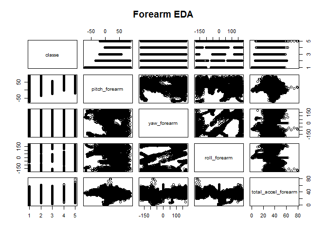
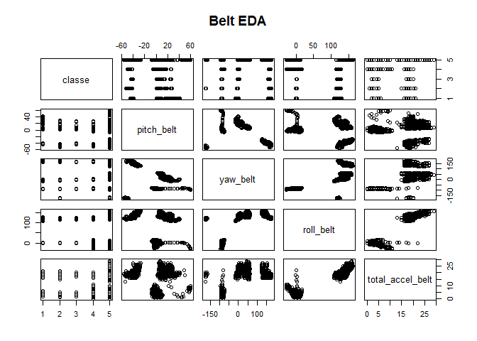
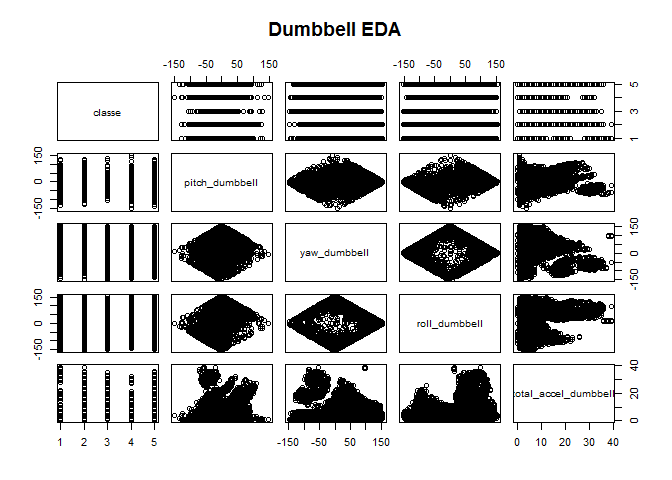
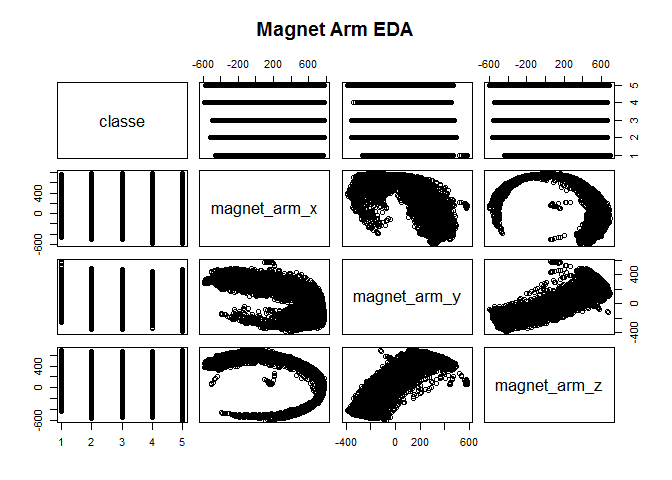
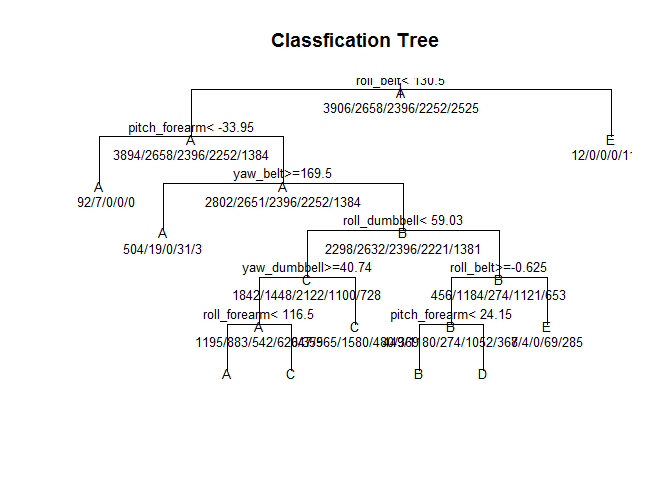

# Practical Machine Learning Project

### Prithvi N.
### June 2015

------------------------------------------


## Synopsis
In this project, we will develop a simple machine learning algorithm to predict whether an exercise (eg. lifting a dumbbell) was performed correctly or not based on sensor data available. 


## Analysis

```
## Warning: package 'caret' was built under R version 3.1.3
```

```
## Warning: package 'e1071' was built under R version 3.1.3
```

We Will load the Dataset. And, also split the dataset into training and test sets to perform cross validation. We will use 70% of the samples in our training set and 30% of the samples in the test set

```r
TotalData <- read.csv("pml-training.csv")

inTrain <- createDataPartition(y=TotalData$classe,p=0.7,list=FALSE)

training <- TotalData[inTrain,]
testing<-TotalData[-inTrain,]
```


A large number of columns in this dataset seem to be cumulative statistics (like mean, std dev, max etc.). Since these statistics do not apply to each of the entries, they could be removed for the purposes of this analysis. So we will remove all those columns with names "max", "min","stddev","skewness","kurtosis","variance","average","amplitude"


```r
to_be_removed<-grep("amplitude",colnames(training))
training<-training[-to_be_removed]
testing<-testing[-to_be_removed]
to_be_removed<-grep("stddev",colnames(training))
training<-training[-to_be_removed]
testing<-testing[-to_be_removed]
to_be_removed<-grep("avg",colnames(training))
training<-training[-to_be_removed]
testing<-testing[-to_be_removed]
to_be_removed<-grep("kurtosis",colnames(training))
training<-training[-to_be_removed]
testing<-testing[-to_be_removed]
to_be_removed<-grep("max",colnames(training))
training<-training[-to_be_removed]
testing<-testing[-to_be_removed]
to_be_removed<-grep("min",colnames(training))
training<-training[-to_be_removed]
testing<-testing[-to_be_removed]
to_be_removed<-grep("skewness",colnames(training))
training<-training[-to_be_removed]
testing<-testing[-to_be_removed]
to_be_removed<-grep("var",colnames(training))
training<-training[-to_be_removed]
testing<-testing[-to_be_removed]
training<-training[-c(1:7)]
testing<-testing[-c(1:7)]
```

We now have a much thinner dataset and now we will need to figure out which of these features could be used to make predictions. We will perform some preliminary data analysis to find out if there is any correlation between the features and the outcome "classe"


```r
pairs(classe~pitch_forearm+yaw_forearm+roll_forearm+total_accel_forearm,data=training,main="Forearm EDA")
```

 

```r
pairs(classe~pitch_belt+yaw_belt+roll_belt+total_accel_belt,data=training,main="Belt EDA")
```

 

```r
pairs(classe~pitch_dumbbell+yaw_dumbbell+roll_dumbbell+total_accel_dumbbell,data=training,main="Dumbbell EDA")
```

 

```r
pairs(classe~magnet_arm_x+magnet_arm_y+magnet_arm_z,data=training,main="Magnet Arm EDA")
```

 

By looking at the plots above we can see that there is some relation between "classe" and the following features

1.Yaw Forearm
2.Pitch Forearm
3.Roll_Forearm
4.Yaw_dumbbell
5.Pitch_dumbbell
6.Roll_dumbbell
7.Total_accel_belt
8.Yaw_belt
9.Roll_belt
10. Magnet_Arm_X

We will now fit the data using a Decision Tree Model using the Train function. We will then use this model to predict the testing data set and calculate the estimated out of sample error.

```r
modfit <- train(classe~yaw_forearm+pitch_forearm+roll_forearm+yaw_dumbbell+pitch_dumbbell+roll_dumbbell+total_accel_belt+yaw_belt+magnet_arm_x+roll_belt,method ="rpart",data=training)
```

```
## Loading required package: rpart
```

```r
plot(modfit$finalModel, uniform=T, main="Classfication Tree")

text(modfit$finalModel,use.n=T,all=T,cex=0.8)
```

 

```r
pred<-predict(modfit,newdata=testing)

confusionMatrix(pred,testing$classe)
```

```
## Confusion Matrix and Statistics
## 
##           Reference
## Prediction    A    B    C    D    E
##          A 1114  213   10  116   62
##          B  131  367  132  118  120
##          C  344  408  880  368  257
##          D   81  149    4  346   40
##          E    4    2    0   16  603
## 
## Overall Statistics
##                                           
##                Accuracy : 0.5624          
##                  95% CI : (0.5497, 0.5752)
##     No Information Rate : 0.2845          
##     P-Value [Acc > NIR] : < 2.2e-16       
##                                           
##                   Kappa : 0.4493          
##  Mcnemar's Test P-Value : < 2.2e-16       
## 
## Statistics by Class:
## 
##                      Class: A Class: B Class: C Class: D Class: E
## Sensitivity            0.6655  0.32221   0.8577  0.35892   0.5573
## Specificity            0.9048  0.89444   0.7166  0.94432   0.9954
## Pos Pred Value         0.7353  0.42281   0.3899  0.55806   0.9648
## Neg Pred Value         0.8719  0.84612   0.9598  0.88262   0.9089
## Prevalence             0.2845  0.19354   0.1743  0.16381   0.1839
## Detection Rate         0.1893  0.06236   0.1495  0.05879   0.1025
## Detection Prevalence   0.2574  0.14749   0.3835  0.10535   0.1062
## Balanced Accuracy      0.7851  0.60832   0.7872  0.65162   0.7764
```

The Accuracy is around 0.55 meaning the estimated Out of Sample Error rate is around 0.45 and it shows that there is scope for a lot of improvement of this model.
